# Wayfarer
A full stack travel community application built using Django as the core frameworke for Python, as well as using Boostrap 5 as a css framework. 

By Abe Garabedian, Amitoj Singh, Bryant Wong, and Nick Arredondo

=== App Link ===

You can access the application here: https://travel-wayfarer.herokuapp.com/

=== About this Application ===

Wayfarer is a travel community application for users to share tips (AKA posts) about their favorite locations around the world. 

=== Technologies Used ===

- Django
- PostgreSQL
- Python
- JavaScript
- jQuery
- CSS
- HTML
- Templates
- Heroku
- Git/GitHub
- Bootstrap 5 CSS framework

=== Screenshots of Site ===

Below, the screenshots of the site created with our clients input:

- Home Page

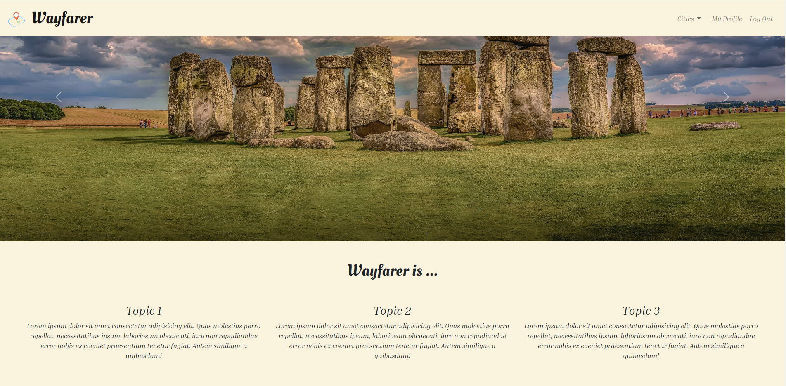

- Login and Sign up Modals

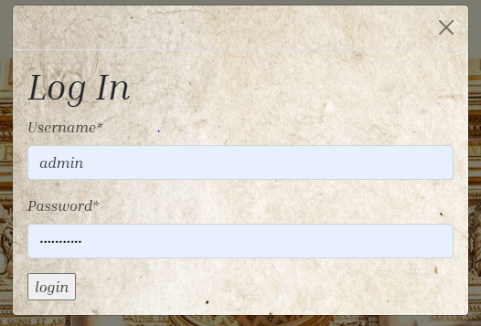
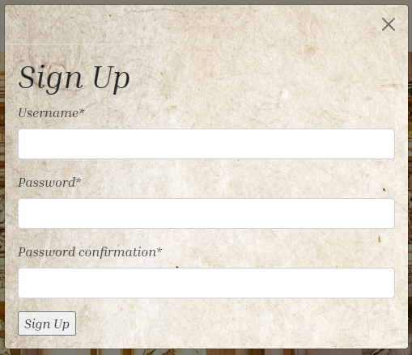

- Profile Page Logged in

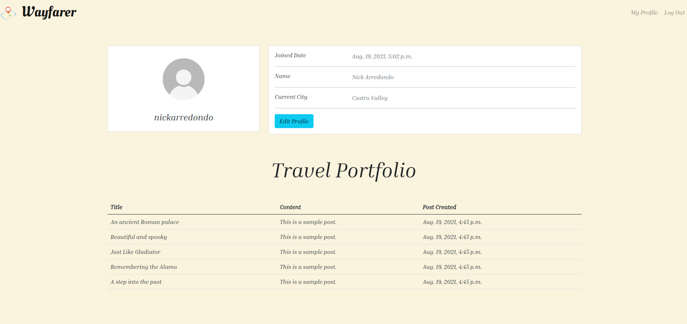

- Profile Page Logged Out

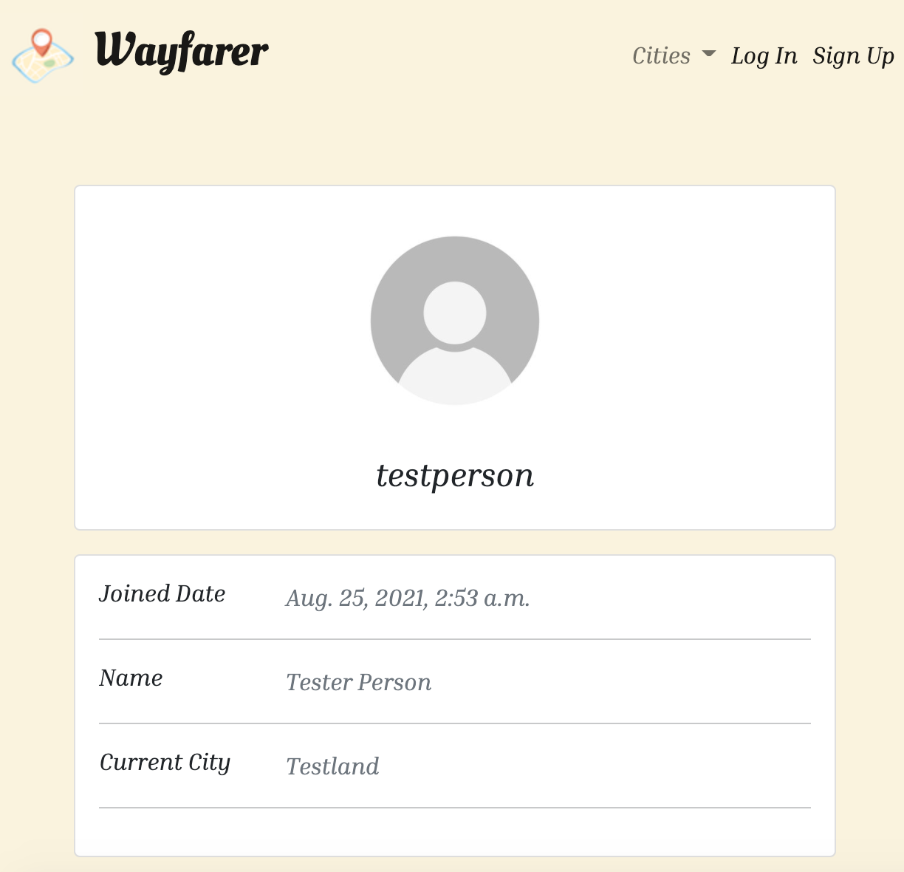

- Edit Profile Modal

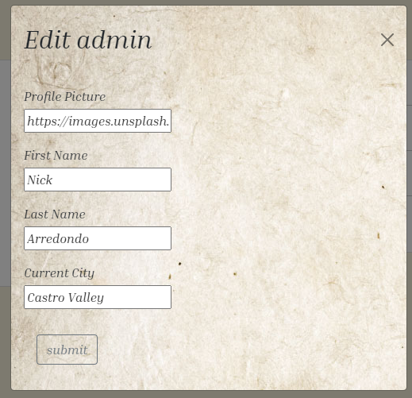

- City Details Page

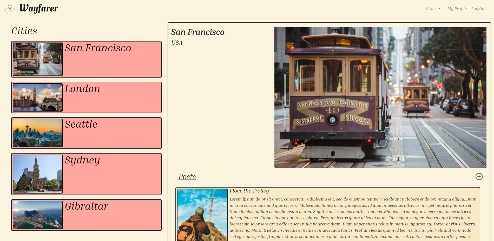

- Post Creation Modal

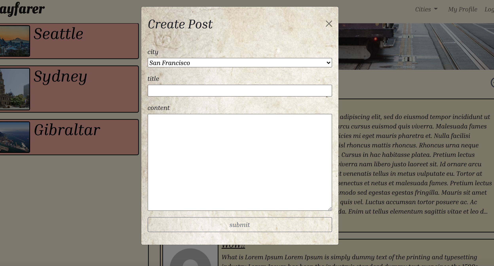

- Post Detail Page

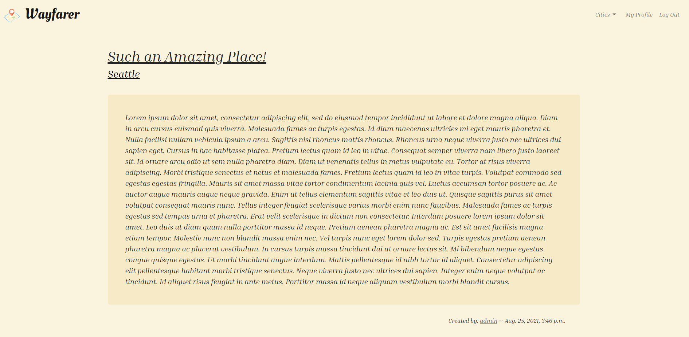

- Edit Post Modal

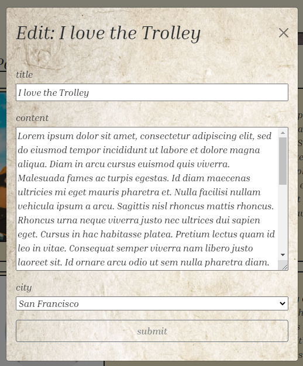

- Post Deletion Modal

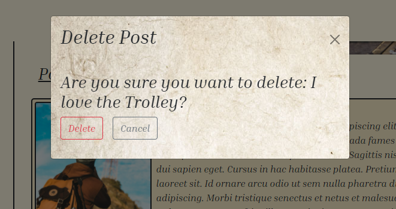

- Comments 

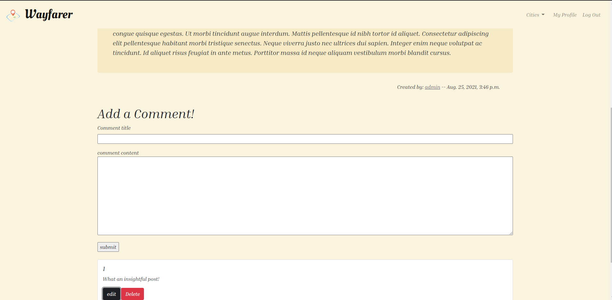

- Edit Comment Modal

=== User Stories ===

Homepage: User will navigate to app and see the site homepage. The homepage is an overview of the website. User will see an image carousel with rotating images. User can click on the arrows overlayed on the image to see the next/previous images. User can see the site-wide header on every page with a link to Log Out if they're logged in or links to login and sign up if they're logged out. Clicking the login link will pull up the login modal form where the user can enter in a username and password. Clicking the sign up link will pull up the sign up modal where the user can enter a chosen username, password, and password confirmation. 

Profile Page: User can login into an account if they already have one or sign up for an account if they do not. After signing in, the user will be redirected to their profile page where they can see a default profile image, name, join date, and current city. User can edit their name, current city, and their profile image.

Post Show Page: User will also see the titles of the posts that they have have contributed and can click on the posts to be redirected to a post show page for that post. Post show page has post title, author, and content for their post as well as date created, and a link to the author's profile page. User's can see comments on individual posts but can only comment if they are logged in. User can edit and delete their own comments.

City Detail Page: The user can navigate to the city details using the dropdown menu in the navbar and selecting the city. The city page contains the site-wide header, the name of the city, an iconic photo of the city, and a cities navigation bar with clickable titles and photos of the cities that redirect to the specific city page. The user will also see a list of posts on the current city page from every user on the website, sorted by newest first. If a post's content is longer than 1000 characters, a "read more" link will display to view the rest of the post. Each post will link to the individual post show pages. A "+" button will pull up the create new post modal form where the user can add a new post to any of the cities in the database. Clicking the edit icon within any posts will pull up the edit post modal form and clicking the delete icon will pull up an alert modal that asks "are you sure you want to delete: post-title." If the user confirms, the post will be deleted. The user cannot create or edit a post title over 200 characters and the post must have content or an error validation banner will display. Additionally the user can only create a post if they are logged in and can only edit and delete posts they have created. 

=== Wireframes ===

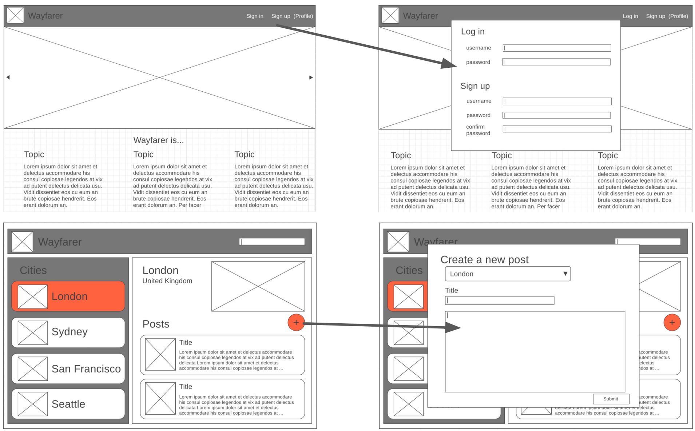